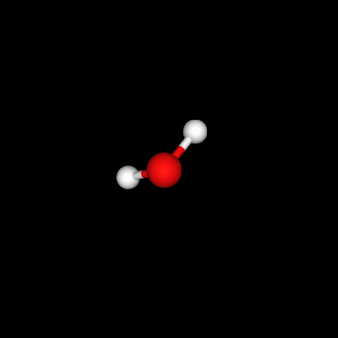
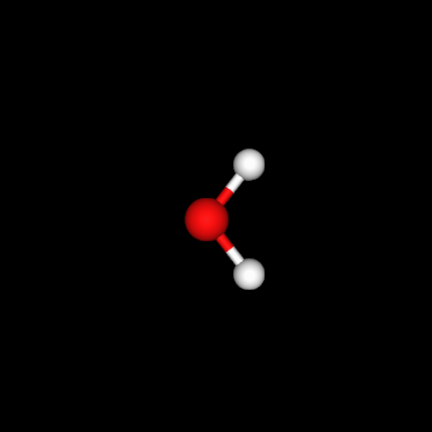
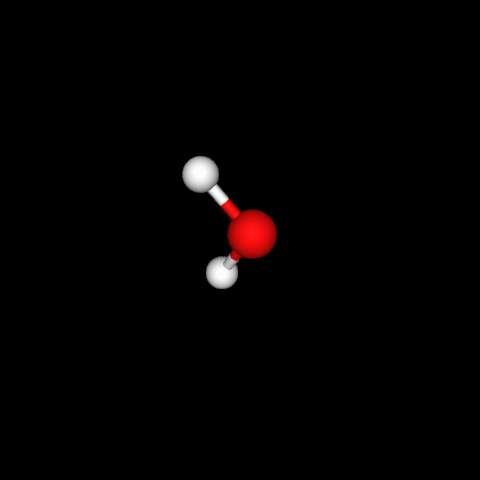
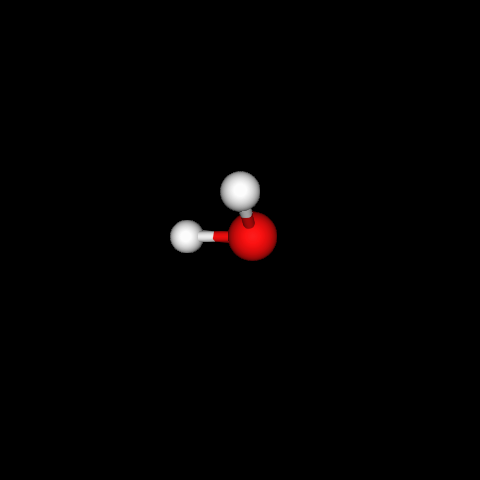

# Equivariant drifting for molecule generation

Code for the Equivariant Drifting project. The main model trains an EGNN-based
molecule generator on QM9: it samples noisy 3D atom positions and atom types,
then learns to drift them toward realistic molecules using an aligned drifting objective, with optional chemical refinement losses.

<p align="center">
  
  
  
  
</p>

The four images show the exact same molecule in different orientations. They
look different in 3D space, but the molecular structure is unchanged. This is
the point of the equivariant generation setup: the model should learn that a
single QM9 molecule can appear in many valid rotations, and generated versions
should match the reference molecule up to orientation rather than only in one
fixed coordinate frame.

## Team

- Edoardo Vergnano
- Orin Pechler
- Daniel Otero Gómez
- Olivier Stam
- Kristian Elde Johansen
- Daniel Sleiman

## Environment

The project expects Python 3.11 and CUDA PyTorch wheels by default.

### Conda

Create the environment once:

```bash
conda env create -f conda_environment.yaml
```

Then activate it before running code:

```bash
conda activate equi
```

Platform-specific environment files are also included:

```bash
conda env create -f conda_environment_windows.yaml
conda env create -f conda_environment_mac.yaml
```

### UV

Install dependencies into `.venv`:

```bash
uv sync
```

Activate the environment:

```bash
# Windows PowerShell
.\.venv\Scripts\Activate.ps1

# macOS/Linux
source .venv/bin/activate
```

## Running Training

The main entry point is `train.py`. On the first run, the QM9 dataset is
downloaded and processed under `data/QM9`.

Start a training run using this command:

```bash
python train.py \
  --n_real_molecules 128 \
  --n_gen_molecules 128 \
  --num_workers 4 \
  --max_epochs 1000 \
  --min_num_atoms 3 \
  --max_num_atoms 12 \
  --hidden_dim 256 \
  --num_layers 8 \
  --max_iter 1 \
  --position_sigma 2.0 \
  --types_sigma 1.0 \
  --position_eta 0.5 \
  --types_eta 0.5 \
  --lr 1e-5 \
  --chem_refinement
```

On a SLURM-managed GPU cluster, submit the provided job script:

```bash
sbatch jobs/train.sh
```

Useful related scripts:

```bash
# Hyperparameter sweep for the aligned loss experiments
python experiments/aligned_loss_sweep.py --smoke

# Geometry-only overfit diagnostic
python experiments/single_molecule_geometry/train_single.py \
  --root data/QM9 \
  --output_dir outputs/single_molecule_geometry \
  --steps 5000
```

## Repository Structure

- `train.py`: main training script for the QM9 molecule generator.
- `parse_args.py`: command-line arguments for data, model, loss, logging, and
  Lightning trainer settings.
- `model/`: core implementation of the project.
  - `datamodule.py`: QM9 loading, preprocessing, filtering, and batching.
  - `egnn.py`: EGNN generator architecture.
  - `lit_module.py`: Lightning module that connects the generator, losses,
    sampling, training, validation, and testing.
  - `drift_loss.py`, `align.py`, `spherical_utils.py`, `chem_loss.py`: aligned
    drifting, atom-type geometry on the sphere, and chemical refinement logic.
  - `callbacks/`: W&B visualizations, chemical validity metrics, gradient
    monitoring, size/atom distributions, and checkpoint helpers.
  - `mol_utils/`: molecule validity, stability, bond, and atom-type utilities.
- `experiments/`: standalone experiment and evaluation scripts, including
  aligned-loss sweeps and atom-type inference evaluation.
- `experiments/single_molecule_geometry/`: geometry-only overfit diagnostics for
  checking whether the EGNN can learn fixed molecular coordinates.
- `jobs/`: SLURM scripts for cluster training, sweeps, and environment setup.
- `notebooks/`: exploratory notebooks used during development.
- `docs/`: extra documentation, especially metric interpretation.
- `data/`: local dataset cache. QM9 is downloaded/processed here by default.
- `checkpoints/`, `lightning_logs/`, `wandb/`: generated training outputs.
- `pyproject.toml`, `uv.lock`: UV/Python dependency configuration.
- `conda_environment*.yaml`: Conda environment definitions.

## Results

Training logs are written with Weights & Biases. To log runs to your own W&B
account, first log in:

```bash
wandb login
```

Then update the W&B configuration in `train.py`. In `wandb.init`, change `entity` to your W&B username or team
name, and optionally change `project`:

```python
run = wandb.init(
    entity="<your-wandb-username-or-team>",
    project="<your-project-name>",
    group=args.group_tag,
    mode="offline" if args.offline else "online",
    config=vars(args),
)
```

Or sync offline runs to your W&B account:

```bash
wandb sync --entity <your-wandb-username> --project <your-project-name> wandb/offline-run-YYYYMMDD_HHMMSS-RUNID
```

Local outputs:

- `wandb/run-*` or `wandb/offline-run-*`: run config, console output, W&B media,
  molecule visualizations, chemical metrics, and saved generator weights.
- `wandb/*/files/individual_components/generator_best.pth`: best generator
  weights by validation loss.
- `wandb/*/files/individual_components/generator_final.pth`: final generator
  weights.
- `lightning_logs/<run_id>/checkpoints/`: Lightning checkpoints for runs using
  the default checkpoint logger.
- `checkpoints/`: best/last checkpoints when `--checkpoint_dir checkpoints` is
  used by checkpointing code.
- `outputs/...` or experiment-specific output directories: CSVs, `.pt` files,
  `.xyz` files, and generated figures from diagnostic experiment scripts.

To inspect training quality, open the W&B run and check `train_loss`,
`val_loss`, `chem/*`, `grad/*`, `geom/*`, and the `mol/*` image panels. See
`docs/MONITORING_METRICS.md` for what each metric means.
